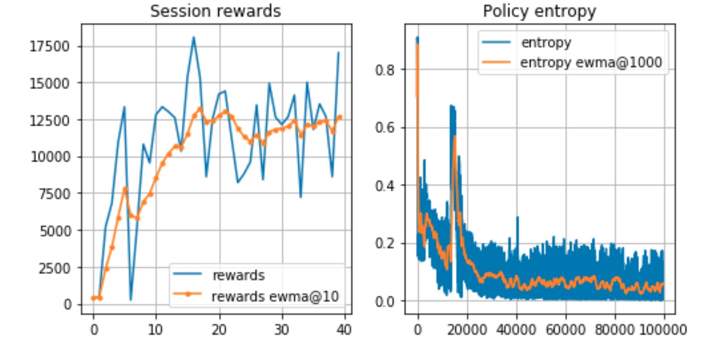
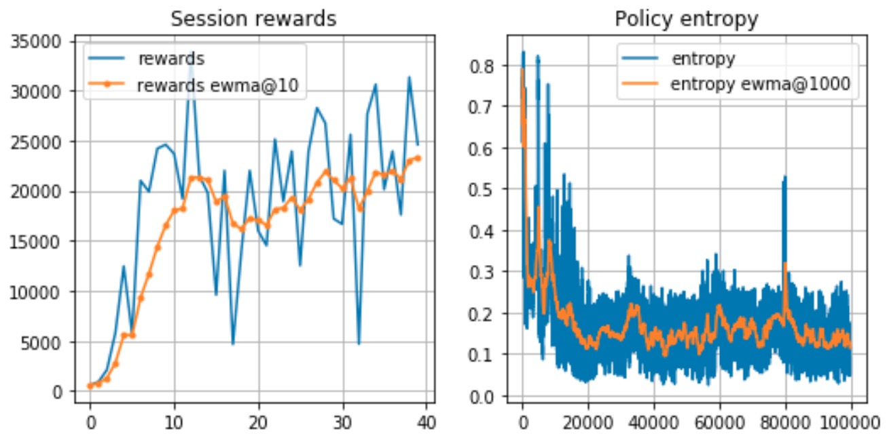

# Demonstration of main Reinforcement Learning Algorithms

---

## List of Implemented Algorithms

- Value-Based Methods
	- [Q-Learning with the q-function approximated using deep learning](ParametarizedQLearning/approx_qlearning.ipynb)
	- [DQN](DQN/dqn_atari.ipynb)
	- [Double Q-Learning with DQN training setup](DQN/double-dqn_atari.ipynb)
- Policy-Gradient-Based Methods
	- [Asynchronous Advantage Actor-Critic Method (A3C)](PolicyGradientMethods/A3C/a3c_KungFuMaster.ipynb)
	- [Differential Reward Asynchronous Advantage Actor-Critic Method (A3C)](PolicyGradientMethods/A3C/differential_reward_a3c_KungFuMaster.ipynb)

## Performance Comparison

#### Policy-Gradient-Based Methods

The average reward (differential reward) A3C algorithm cares about distant rewards as much as about immediate rewards (no discounting). This change of the reward funciton leads to a more efficient local optima policy which achieves significantly reward. The charts below illustrate the average reward per game.

[**Vanilla A3C**](PolicyGradientMethods/A3C/a3c_KungFuMaster.ipynb)

The chart presents the scores of the vanilar A3C with the reward per game converging at ~ 12500 level.

[**Average Reward A3C**](PolicyGradientMethods/A3C/differential_reward_a3c_KungFuMaster.ipynb)

The chart presents results of the average geward (differential reward) A3C. The average reward A3C achieved around 22500 level within the same training time as vanilla A3C.
